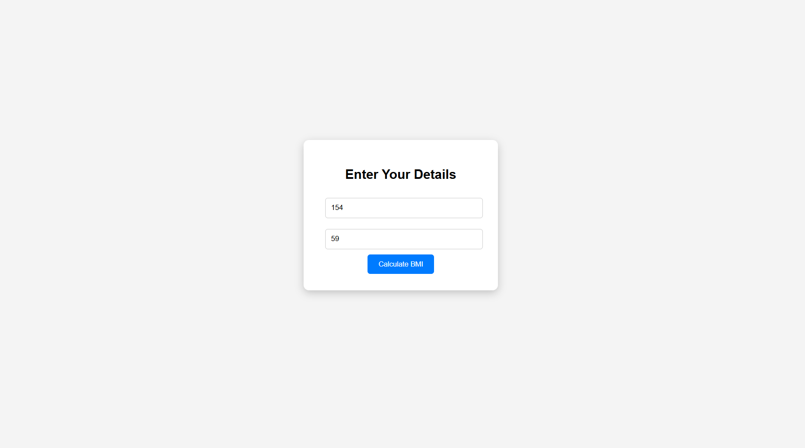
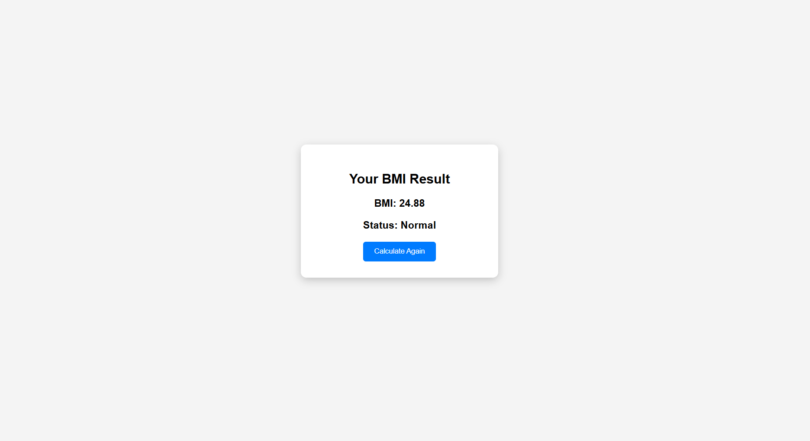

# Ex06 BMI Calculator
## Date: 15.3.26

## AIM
To develop a responsive and interactive Body Mass Index (BMI) Calculator using React that allows users to input their height and weight, and calculates their BMI to categorize their health status (e.g., Underweight, Normal, Overweight, Obese).

## DESIGN STEPS

### STEP 1: Initialize React Project

<li>Create a new React app using create-react-app.</li>
<li>Install React Router using:</li>
npm install react-router-dom

### STEP 2: Set Up Routing

Create routing structure with react-router-dom:

<li>Home route (/) – Intro or Navigation</li>

<li>BMI Calculator route (/bmi)</li>

<li>Result route (/result)</li>

### STEP 3: Design the BMI Form Page

<li>Create a form to accept Height (in cm or m) and Weight (in kg).</li>

<li>On form submit, navigate to the result page with entered values via URL query params or context/state.</li>

## STEP 4: Handle Input Validation

<li>Check if height and weight are valid numbers.</li>

<li>Optionally, show error messages for invalid inputs.</li>

### STEP 5: Perform BMI Calculation

<li>In the result component:

<li>Extract height and weight from the route (URL or passed state).</li>

<li>Apply the BMI formula:</li>


​
 
<li>Convert height from cm to m if needed.</li></li>

### STEP 6: Display Result

<li>Show calculated BMI.</li>

<li>Show category based on BMI range:

<li>Underweight, Normal, Overweight, Obese, etc.</li></li>

### STEP 7: Navigation Options

<li>Provide a button to go back to the BMI form to calculate again.</li>

### STEP 8: Enhancements

<li>Add styling using CSS or Tailwind.</li>

## PROGRAM
css
```
body{
font-family:Arial;
background:#f4f4f4;
display:flex;
justify-content:center;
align-items:center;
height:100vh;
}

.container{
background:white;
padding:30px;
border-radius:10px;
text-align:center;
box-shadow:0 5px 15px rgba(0,0,0,0.2);
width:300px;
}

input{
width:90%;
padding:10px;
margin:10px;
border:1px solid #ccc;
border-radius:5px;
}

button{
padding:10px 20px;
background:#007bff;
color:white;
border:none;
border-radius:5px;
cursor:pointer;
}

button:hover{
background:#0056b3;
}
```

jss
```
import React, { useState } from "react";
import { useNavigate } from "react-router-dom";

function BMIForm() {

const [height, setHeight] = useState("");
const [weight, setWeight] = useState("");

const navigate = useNavigate();

const handleSubmit = (e) => {
e.preventDefault();

if(height === "" || weight === ""){
alert("Enter valid values");
return;
}

navigate("/result", { state: { height, weight } });

};

return (

<div className="container">

<h2>Enter Your Details</h2>

<form onSubmit={handleSubmit}>

<input
type="number"
placeholder="Height (cm)"
value={height}
onChange={(e)=>setHeight(e.target.value)}
/>

<input
type="number"
placeholder="Weight (kg)"
value={weight}
onChange={(e)=>setWeight(e.target.value)}
/>

<button type="submit">Calculate BMI</button>

</form>

</div>

);

}

export default BMIForm;
```
## OUTPUT




## RESULT
The BMI Calculator successfully takes user input for height and weight, performs the BMI calculation in real-time using React state and event handling, and displays the BMI value along with the corresponding health category.
